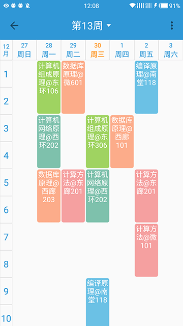
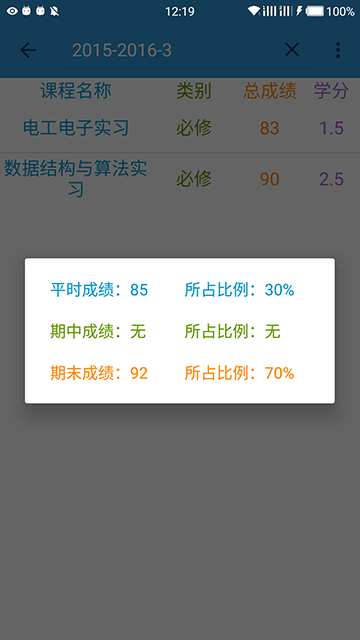
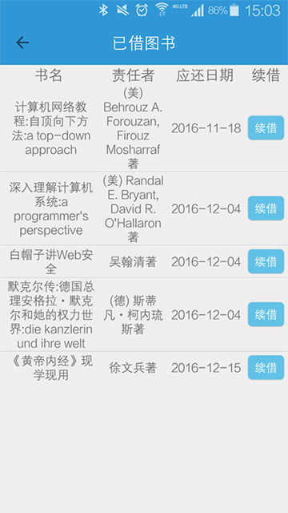
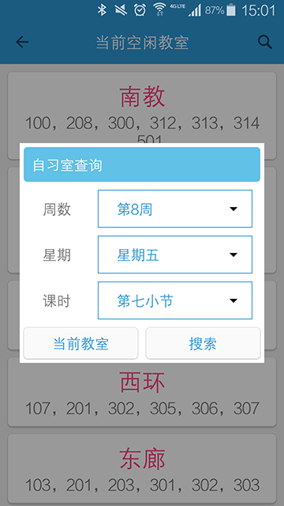

 
# 
APP简介

 
　　UPCAid是UPC校园助手类APP，旨在为在校同学提供更加方便快捷的校园信息，使同学们的校园生活更加便捷。截止目前，用户数量已达2000+。
 
# 
功能介绍

### 课表

自动获取课表，无需手动添加

### 成绩

成绩详细信息，离校也能查

### 图书馆

图书续借，不怕超期。

### 自习室

自习教室，轻松获得。

 
# 
<a href="http://120.27.117.34:4549/SZSDServlet2/UPCAid.apk">点我或扫码下载</a>  

 

<a href="https://github.com/xhaiben/SZSD"><i class="fa fa-fw fa-github"></i>项目GitHub链接</a>

  
APP目前仅有Android版，希望能获得您的支持用以开发ios版。

  <button id="rewardButton" disable="enable" onclick="reward()">赏
  </button>

微信打赏

      

支付宝打赏

      

